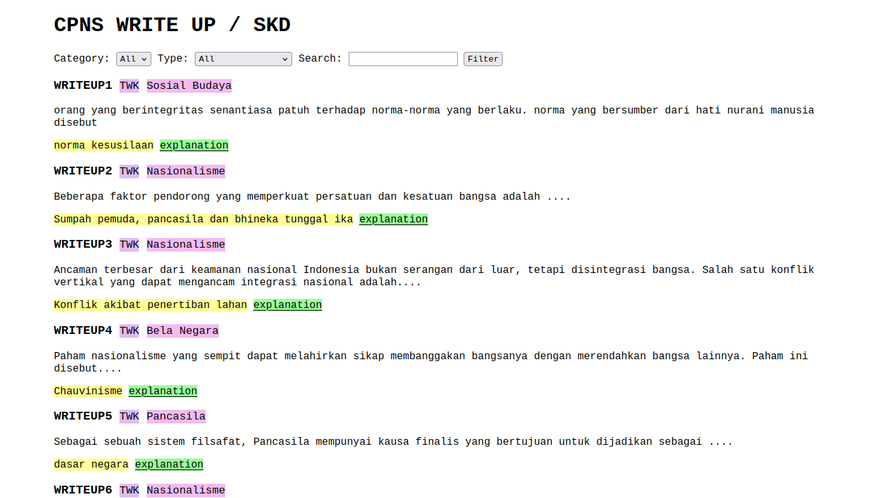
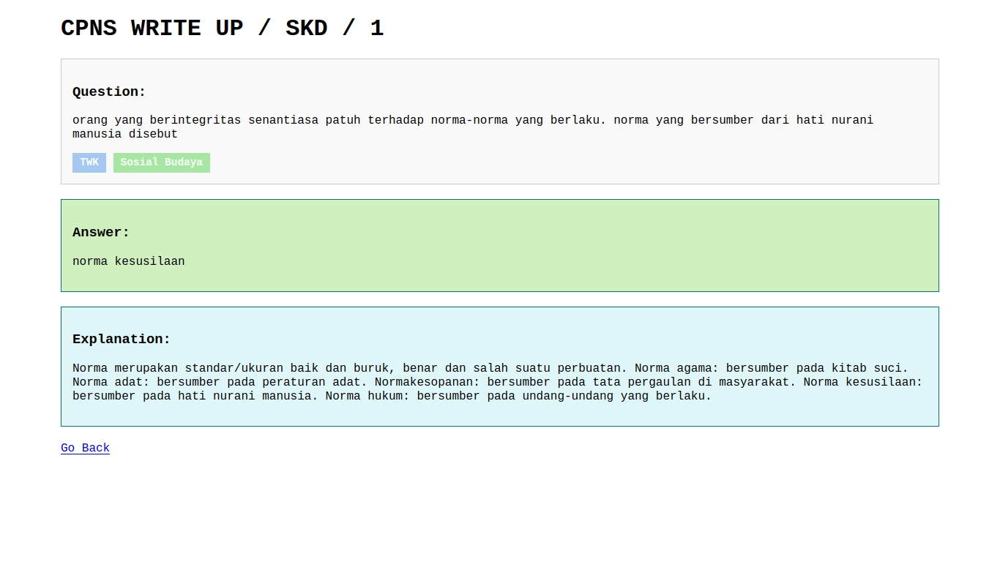

# Installation Guide

Follow these steps to install and run the project:

## Prerequisites

- **PHP**: Version 7.4 or higher
- **Database**: MySQL or any other compatible database

## Installation Steps

1. **Clone the Repository**
    ```sh
    git clone https://github.com/baguswijaksono/cpns-wrtp.git
    cd cpns-wrtp
    ```

2. **Set Up Environment Variables**
    Copy the `.env.example` file to `.env` and update the necessary configurations.
    ```sh
    cp .env.example .env
    ```

3. **Start the Development Server**
    ```sh
    php -S localhost:8080
    ```

4. **Run Database Migrations**
    Open your web browser and navigate to:
    ```
    http://localhost:8080/migrate
    ```

5. **Access the Application**
    Open your web browser and navigate to:
    ```
    http://localhost:8080
    ```

## Showcase





